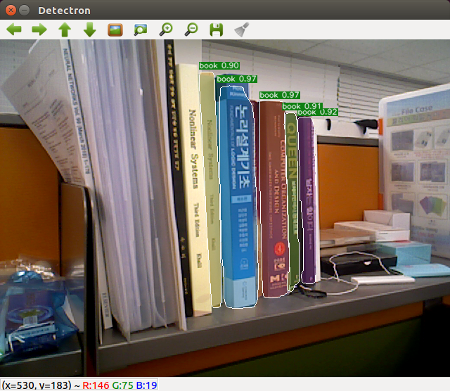
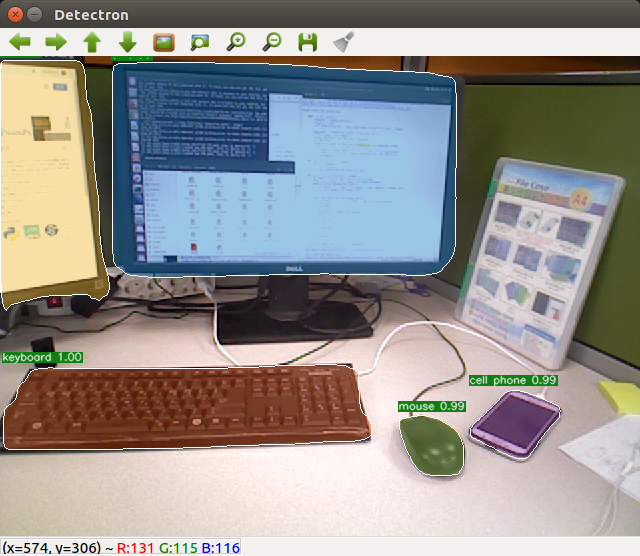

# DETECTRON_ROS:MASK R-CNN FOR ROS

 Detectron_ros is designed to allow Detectron to use image detection in real time using a live camera in ROS emvironment. This program includes [Mask R-CNN](https://arxiv.org/abs/1703.06870). It is written in Python and powered by the [Caffe2](https://github.com/caffe2/caffe2) deep learning framework.

You can see that Mask R-CNN algorithm runs in real time as fonnows using this program.
<div align="center">
  
  
</div>

## License

Detectron is released under the [Apache 2.0 license](https://github.com/facebookresearch/detectron/blob/master/LICENSE). See the [NOTICE](https://github.com/facebookresearch/detectron/blob/master/NOTICE) file for additional details.

## Installation

This document covers how to install Detectron and its dependencies (including Caffe2)

**Requirements:**

- NVIDIA GPU, Linux, Python2
- Caffe2, various standard Python packages, and openni2_launch(optional); Instructions for installing these dependencies are found below

**Notes:**

- Detectron operators currently do not have CPU implementation; a GPU system is required.
- Detectron_ros has been tested extensively with CUDA 10.1 and cuDNN 7.5.0.56.

## Caffe2

To install Caffe2 with CUDA support, follow the [installation instructions](https://caffe2.ai/docs/getting-started.html) from the [Caffe2 website](https://caffe2.ai/). **If you already have Caffe2 installed, make sure to update your Caffe2 to a version that includes the [Detectron module](https://github.com/pytorch/pytorch/tree/master/modules/detectron).**

Please ensure that your Caffe2 installation was successful before proceeding by running the following commands and checking their output as directed in the comments.


## Detectron

To install Detectron, follow the [Detectron github website](https://github.com/facebookresearch/Detectron/) and refer to the following [Installation instructions](https://github.com/facebookresearch/Detectron/blob/master/INSTALL.md)

## OpenCV

This program uses OpenCV 3.3 to display the image. To install the OpenCV 3.3 version in python, write as below.
```
pip2 install --user opencv-python==3.3.1.11
or
python2 -m pip install --user opencv-python==3.3.1.11
```

## ROS dependencies

This program has the following ROS dependencies.
- cv_bridge
- image_transport

These packages provide an environment for transferring images form camera to this program. you can download them from websites below.
- https://github.com/ros-perception/vision_opencv
- https://github.com/ros-perception/image_common


## Openni2_launch(optional)

This program uses openni_launch to make camera images available in real time using ROS.
If you use Ubuntu,
```
$ sudo apt install ros-kinetic-openni2-launch
or
$ sudo apt install ros-melodic-openni2-launch
```

Or you can download it from the site below and install it.
- https://github.com/ros-drivers/openni2_camera

You can use other ros packages to use the camera. If your live camera program provides an image of the camera with topic of the following name, you can use it.
```
/camera/rgb/image_raw
```
You can edit the topic name [in this file](https://github.com/justice-suri/detectron_ros/blob/master/src/detectron_ros/run)

## Usage

If you use openni2_launch, launch this program:
```
roslaunch detectron_ros openni.launch
```

If you want to use anther live cam package, you can do as follows.
```
rosrun detectron_ros run
```


